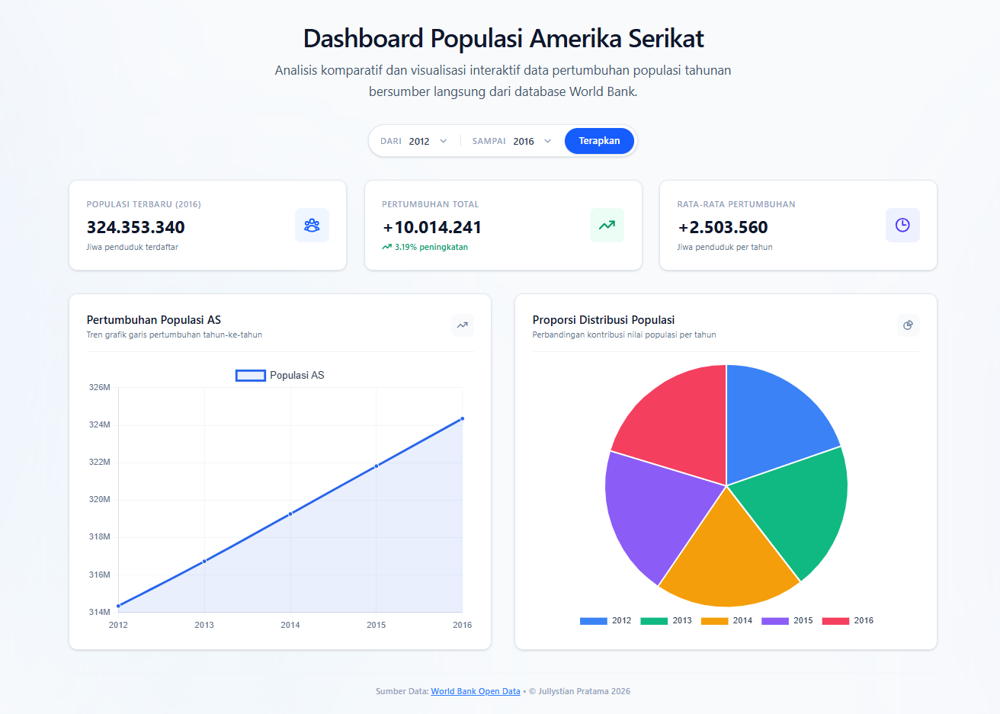

# US Population Dashboard — Frontend Developer Test

[](https://nextjs.org/)
[](https://react.dev/)
[](https://tailwindcss.com/)
[](https://www.typescriptlang.org/)
[](https://www.chartjs.org/)

Sebuah aplikasi web dashboard interaktif yang menyajikan visualisasi data historis populasi Amerika Serikat secara dinamis, real-time, dan responsif. Aplikasi ini dikembangkan untuk memenuhi tugas **Frontend Developer Test (NoLimit)** menggunakan **Next.js** (App Router), **Tailwind CSS v4**, dan **Chart.js**.

Data populasi diintegrasikan secara langsung menggunakan REST API dari **World Bank Open Data**.

---

## ✨ Fitur Utama

1. **Dashboard Statistik Ringkas (Stats Cards)**
   * **Populasi Terbaru**: Menampilkan jumlah jiwa terdaftar di tahun terakhir rentang pilihan.
   * **Pertumbuhan Total**: Menghitung selisih pertumbuhan jiwa beserta persentase kenaikannya.
   * **Rata-rata Pertumbuhan**: Menyajikan rata-rata peningkatan jumlah penduduk per tahun.

2. **Visualisasi Data Interaktif (Chart.js)**
   * **Line Chart**: Grafik garis interaktif yang memetakan tren pertumbuhan populasi dari tahun ke tahun. Dilengkapi dengan tooltip dan efek hover yang responsif.
   * **Pie Chart (Doughnut)**: Grafik proporsi kontribusi populasi per tahun untuk melihat distribusi data secara komparatif.

3. **Date Range Filter & Validasi Cerdas**
   * Filter dinamis untuk membatasi visualisasi data berdasarkan rentang tahun tertentu.
   * Dilengkapi validasi bawaan: mencegah tahun awal melebihi tahun akhir, membatasi rentang pilihan dari tahun 1960 hingga tahun saat ini secara dinamis.

4. **Optimasi Kinerja (Background Prefetching)**
   * **Instant Load**: Memuat data rentang kecil (2012–2016) terlebih dahulu secara cepat agar pengguna tidak menunggu lama di awal.
   * **Latar Belakang (Prefetch)**: Setelah visualisasi pertama selesai, aplikasi secara senyap mengambil seluruh data historis (1960–sekarang) dan menyimpannya di memori. Pemfilteran tahun berikutnya akan berjalan **instan tanpa request jaringan ulang** (Zero-latency filtering).

5. **Desain Premium & UI/UX Modern**
   * Tampilan modern dengan perpaduan warna HSL harmonis, efek aurora background, transisi yang mulus, dan tata letak *Clean Minimalist*.
   * Menggunakan Skeleton Loading saat memuat data dari API untuk memberikan pengalaman pengguna yang mulus.
   * Responsif penuh pada perangkat mobile, tablet, maupun desktop.

---

## 📸 Screenshot / Preview



---

## 🛠️ Tech Stack

* **Core Framework**: [Next.js 16 (App Router)](https://nextjs.org/)
* **Library UI**: [React 19](https://react.dev/) & [React DOM](https://react.dev/)
* **Styling & Theme**: [Tailwind CSS v4](https://tailwindcss.com/) (dengan dukungan native css variables & PostCSS)
* **Charts Engine**: [Chart.js](https://www.chartjs.org/) & [React ChartJS 2](https://react-chartjs-2.js.org/)
* **Data Provider**: [World Bank Public API](https://data.worldbank.org/)
* **Type System**: [TypeScript](https://www.typescriptlang.org/)

---

## 📁 Struktur Proyek

Berikut adalah ringkasan struktur folder penting dalam proyek ini:

```bash
nolimit-fe-test/
├── src/
│   ├── app/                    # Next.js App Router (Layout & Entry Point)
│   │   ├── globals.css         # Global Styles & Tailwind Directives
│   │   ├── layout.tsx          # Root Layout Wrapper
│   │   └── page.tsx            # Main Home Page
│   ├── components/             # Reusable UI Components
│   │   ├── Dashboard.tsx       # Core Dashboard View & State Management
│   │   ├── DateRangeFilter.tsx # Filter Input Component with validations
│   │   ├── PopulationLineChart.tsx # Wrapper Line Chart
│   │   └── PopulationPieChart.tsx  # Wrapper Pie Chart
│   └── lib/
│       └── api.ts              # API fetcher & data parser for World Bank API
├── package.json                # Project Dependencies & Scripts
├── tsconfig.json               # TypeScript Configuration
└── tailwind.config.ts          # Tailwind CSS Configuration
```

---

## 🚀 Instalasi & Penggunaan Lokal

Ikuti langkah-langkah di bawah ini untuk menjalankan proyek ini di mesin lokal Anda:

### 1. Prasyarat (Prerequisites)
Pastikan Anda sudah menginstal Node.js di komputer Anda (Disarankan Node.js versi 18.x atau yang lebih baru) serta `npm` atau `yarn`.

### 2. Clone Repository
```bash
git clone https://github.com/Jullystian017/nolimit-fe-test.git
cd nolimit-fe-test
```

### 3. Install Dependencies
Instal seluruh paket dependensi yang dibutuhkan:
```bash
npm install
```

### 4. Jalankan Development Server
Mulai server lokal untuk development:
```bash
npm run dev
```
Buka browser Anda dan akses di **[http://localhost:3000](http://localhost:3000)**. Perubahan kode yang Anda buat akan langsung direfleksikan secara instan melalui fitur *Hot Module Replacement* (HMR).

### 5. Build & Start untuk Production
Untuk membuat build versi produksi yang dioptimalkan:
```bash
npm run build
npm run start
```

---

## 📝 Catatan Tambahan & Optimalisasi Kode
* **Desain Responsif**: Elemen grafik otomatis mengecil dan menata ulang tata letaknya (stacking) di layar ukuran mobile agar grafis tetap mudah dibaca.
* **Error Handling**: Jika API World Bank down atau terjadi kegagalan koneksi internet, aplikasi akan menampilkan Alert merah informatif yang ramah pengguna.
* **Pengurutan Data**: Data dari API World Bank secara default dikirim secara menurun (dari tahun terbaru ke terlama). Aplikasi kami secara otomatis membalikkan dan mengurutkannya secara menaik (*ascending*) agar grafik dapat menyajikan alur waktu dengan benar dari kiri ke kanan.

---

## 👨‍💻 Developer

* **Nama**: Jullystian Pratama
* **Tahun**: 2026
* **Tugas**: Frontend Developer Test — NoLimit
